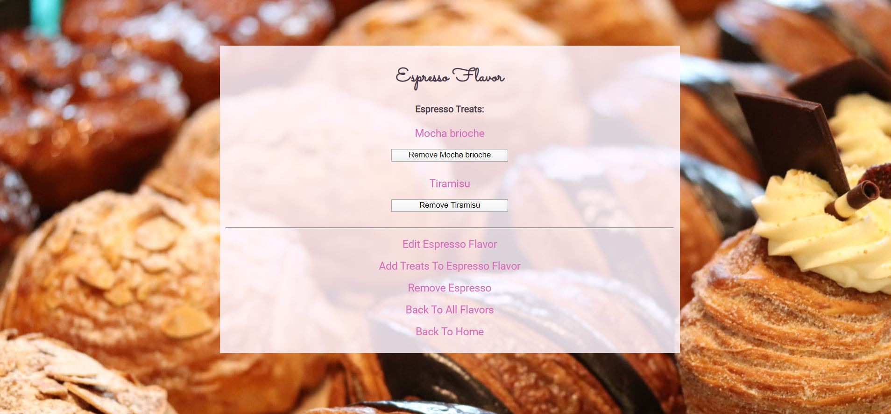

# [Della Bakery's Treat Tracker](https://github.com/ayohana/TreatTracker.git/)

#### C# Advanced Databases and Authentication Exercise for [Epicodus](https://www.epicodus.com/), 03.27.2020

#### By [**Adela Darmansyah**](https://ayohana.github.io/portfolio/)

## Description

**This is a web application for Della's Bakery to keep track of their sweet and savory treats after a user is authenticated.** Della will be able to create an account and log in to use the application. Once logged in, she will be able to enter her treats (e.g. chocolate croissants) and their flavors (e.g. sweet). Per Della's request, the application will list all treats and flavors. She will be able to see the details of an individual treat to see all the flavors that belong to it and vice versa.

## Screenshots

##### Homepage:

##### List of flavors:

##### Adding a new flavor:

##### A flavor's details:

##### A treat's details:

##### Updating a treat:

##### Removing a treat:

##### Adding a flavor to a treat:

## User Stories

* As the bakery owner, I need to be able to see a list of all my treats.
* As the bakery owner, I need to be able to add flavors belonging to a treat and vice versa.
* As the bakery owner, I need to be able to select a treat, see their details and see a list of flavors that belong to that treat.
* As the bakery owner, I also need to be able to select a flavor and see a list of treats that belong to that flavor.
* As the bakery owner, I want my branch managers to have their own separate accounts. I want my managers to be able to see their own treats and flavors listed on their respective accounts.
* As the developer, I need to establish many-to-many relationship between `Treats` and `Flavors` so that I can fulfil my client's request.
* As the developer, I want to authenticate users before they can use the application.

## Improvement Opportunities

* Add a third class of `Ingredients` (many-to-many relationship between Treats & Ingredients) to sort list/provide allergy warning.
* Have separate roles for admins and logged-in users. Only admins should be able to add, update and delete.

## Specs

  
Click to expand!

| Spec | Input | Output |
| :-------------     | :------------- | :------------- |
| **The application will ask for user authentication prior to using the application.** | Log in | Welcome message and Log In form |
| **The application displays a message when there are no treats/flavors saved in the database.** | Treats/Flavors page | "No treats/flavors added yet." |
| **The application displays a splash page that lists all treats/flavors** | Treats/Flavors page | List of all treats/flavors |
| **The application will provide links to add a new treat/flavor** | Treats/Flavors page | Displays a form to fill out a new treat/flavor |
| **The user clicks on a flavor and the application will display a list of treats belonging to that flavor** | `Click:` "Sweet" | "Chocolate croissants, cupcakes, lollipops" |
| **The user clicks on a treat and the application will display a list of flavors belonging to that treat** | `Click:` "Green Tea Mousse" | "Sweet, rich, creamy" |

## Setup/Installation Requirements

* Download [.NET Core](https://www.learnhowtoprogram.com/c-and-net/getting-started-with-c/installing-c-and-net) (Mac/Windows OS) - _FREE!_
* Download [MySQL](https://www.learnhowtoprogram.com/c-and-net/getting-started-with-c/installing-and-configuring-mysql) (Mac/Windows OS) - _FREE!_
* Clone this [repository](https://github.com/ayohana/TreatTracker.git/)
* Run the application.
  * Navigate into the `TreatTracker` directory `$ cd Desktop/TreatTracker/TreatTracker.Solution/TreatTracker`
    * Enter the command `dotnet restore` to gather tools and dependencies for the application.
    * Enter the command `dotnet build` to build the project using its dependencies.
    * Enter the command `dotnet ef database update` to create a new, empty database. 
    * Enter `dotnet run` to run the application.
    * Enter URL `http://localhost:5000/` in your preferred browser.

## Known Bugs

3/27/20 (RESOLVED):
Occurs when a user enters URL `http://localhost:5000/`.
Exception handling applied to prevent the application from crashing.

## Support and contact details

Feel free to provide feedback via email: adela.yohana@gmail.com.

## Technologies Used

* C#
* MVC Pattern
* [.NET Core](https://dotnet.microsoft.com/download/dotnet-core/) (Windows OS)
* [MySQL](https://dev.mysql.com/downloads/file/?id=484919) (Windows OS)
* [EF Core](https://github.com/PomeloFoundation/Pomelo.EntityFrameworkCore.MySql)

### License

This C# console application is licensed under the MIT license.

Copyright (c) 2020 **Adela Darmansyah**
